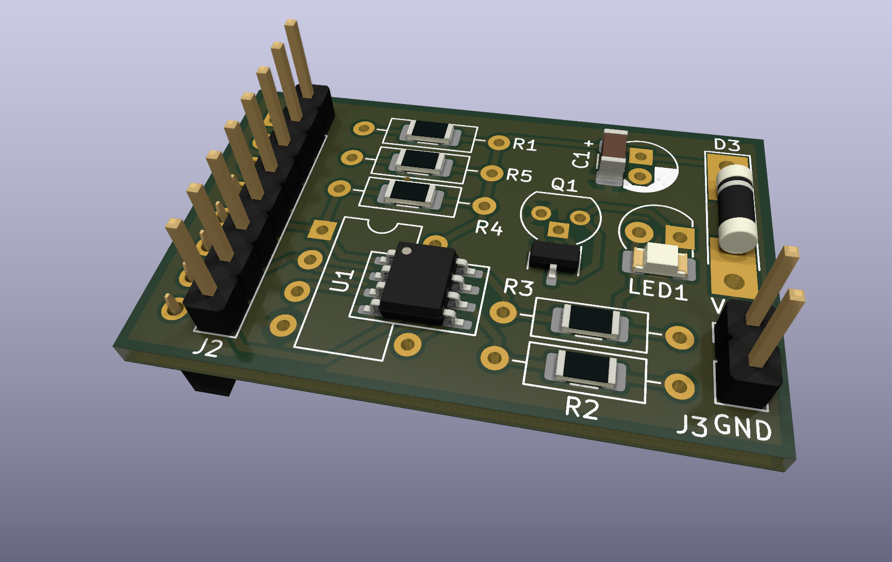

# SRAM Board evolved
## An Add-On for the ATmega644(A) Evaluation Board

This is an add-on for the [EvaBoard evolved](https://github.com/7vgn/EvaBoard/) ATmega644(A) evaluation board. It is inspired by (and compatible with) the [add-on board](https://www.embedded.rwth-aachen.de/doku.php?id=lehre:atmegaevaboard) used in the lab course "Praktikum Systemprogrammierung" in the computer science curriculum at RWTH Aachen. It can be used both with the original evaluation board and its remake. 

This repository contains:

- A richly illustrated [Guide Book](Guide/SRAMBoardGuide.pdf) with everything you need to know to build and use the board
- A [KiCAD project](KiCAD/) with the [Schematic](KiCAD/Schematic.pdf) and a PCB layout, ready to be manufactured
- The [bill of materials](BOM/BOM.pdf)
- [Test code](Tests/) for testing and debugging the board

